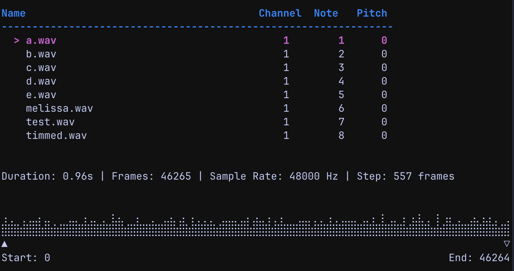

# smplr

A MIDI-controlled audio sampler with a terminal user interface.



## Features

- 🎹 **MIDI Control**: Trigger WAV samples via MIDI notes
- 🎚️ **Pitch Shifting**: Adjust pitch per sample (-12 to +12 semitones) with offline rendering using RubberBand
- 📊 **Waveform Display**: Visual feedback with adjustable start/end markers
- ✂️ **Sample Trimming**: Edit samples directly in the interface
- 🎙️ **Audio Recording**: Record system audio using ScreenCaptureKit
- ⚡ **Low Latency**: Native CoreAudio playback via Swift bridge
- 🖥️ **Terminal UI**: Keyboard-driven interface powered by Bubble Tea

## Prerequisites

- macOS 12.3 or later (requires ScreenCaptureKit API)
- Go 1.21 or later
- Swift compiler
- [RubberBand](https://breakfastquay.com/rubberband/) audio library
- MIDI controller (optional)

## Installation

### Via Homebrew

Install RubberBand:
```bash
brew install rubberband
```

### Building from source

```bash
./build.sh
```

This compiles the Swift audio bridge and builds the Go application.

## Running

```bash
./smplr
```

The application will load WAV files from the current directory and map them to incremental MIDI notes starting from note 1 on channel 1.

## Keyboard Controls

- **j/k** or **↑/↓**: Navigate through samples
- **c**: Edit MIDI channel
- **n**: Edit MIDI note
- **p**: Edit pitch shift
- **Space**: Play selected sample
- **Enter**: Play region (between start/end markers)
- **t**: Trim sample to region
- **r**: Start/stop recording
- **h/l**: Adjust start marker (when selected)
- **H/L**: Adjust end marker (when selected)
- **q**: Quit

## Architecture

- **Go**: Main application, TUI, MIDI handling, and file management
- **Swift**: Low-level audio playback, recording, and pitch shifting via CoreAudio/AVFoundation
- **RubberBand**: High-quality pitch shifting engine
- **Bubble Tea**: Terminal UI framework
- **CGO**: Bridge between Go and Swift

## Releases

See the [releases page](https://github.com/chriserin/smplr/releases) for pre-built binaries.
